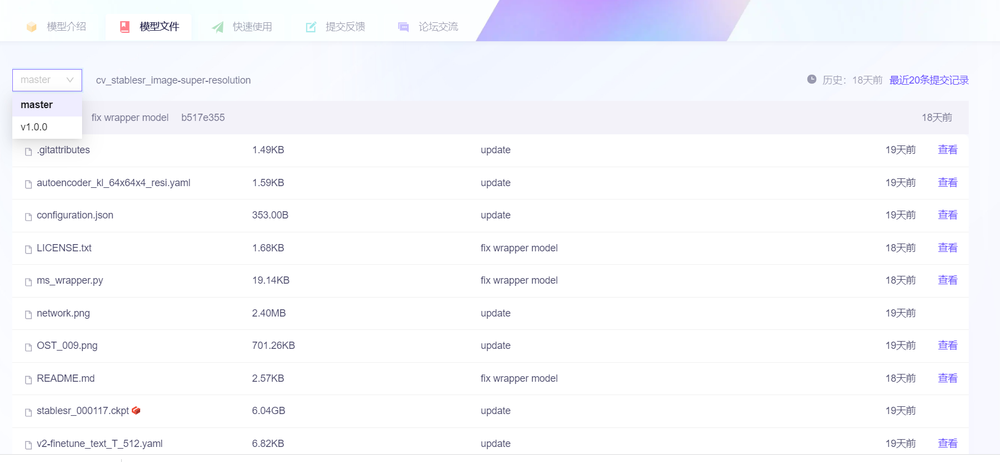

## 下载模型遇到的坑

默认模型会下载到`~/.cache/modelscope/hub`中，如果需要修改下载目录，可以手动指定环境变量：`MODELSCOPE_CACHE`，modelscope 会将模型和数据集下载到该环境变量指定的目录中。（参考[官网文档](https://modelscope.cn/docs/%E6%A8%A1%E5%9E%8B%E7%9A%84%E4%B8%8B%E8%BD%BD）)

`revision`为可选参数，不指定版本会取模型默认版本，默认版本，默认版本为ModelScope library发布前最后一个版本如果下载模型报错:
```
modelscope.hub.errors.NoValidRevisionError：The model: [modelname] has no valid revision!
```
意思是没有一个合法的版本号，这时请手动指定版本号。这个问题困扰了我一天时间，只能说`modelscope`平台的体验还很差。下载模型的示例代码见`snapshot_download.py`文件。

如何查看可选的版本号呢？在 modelscope 的**模型文件**一栏可以查看。

